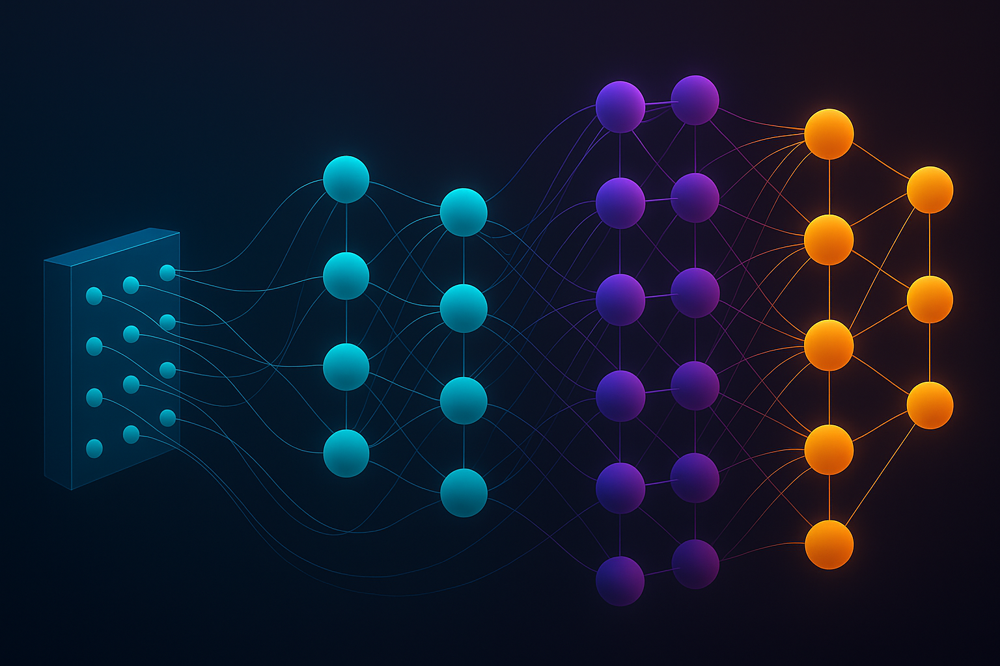

<!-- Header image -->

  

<h1 align="center">Hi 👋, I'm Jeysshon</h1>

<em>Bioengineer · Data Scientist · MLOps Architect</em>

---

### 🌐 Connect

---

⚙️ Tech stack & tools

| Área | Herramientas |
|------|--------------|
| 🐍 Lenguajes | Python, SQL |
| 🤖 ML / DL | PyTorch, TensorFlow, scikit‑learn |
| 📊 Data | Pandas, Spark, MySQL, Teradata |
| 🚀 DevOps | Docker, Kubernetes, AWS, MLflow |

---

### ✨ Highlights

- ⚙️ Specialist in end‑to‑end pipelines for **high‑sensitivity data**  
- 🏥 Healthcare, 🏦 Finance risk & ⚙️ Industrial safety use cases  
- 🤖 Creator of the [skin‑cancer detector on Hugging Face Spaces](https://huggingface.co/spaces/jeycov/Piel_cancer_prueba)

